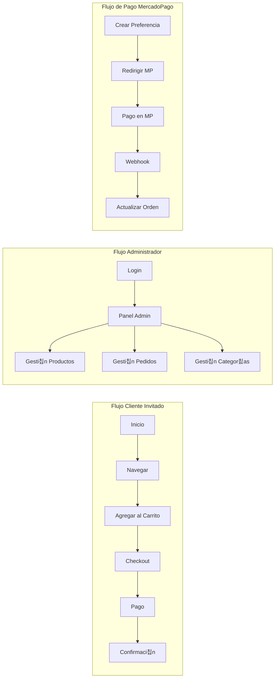
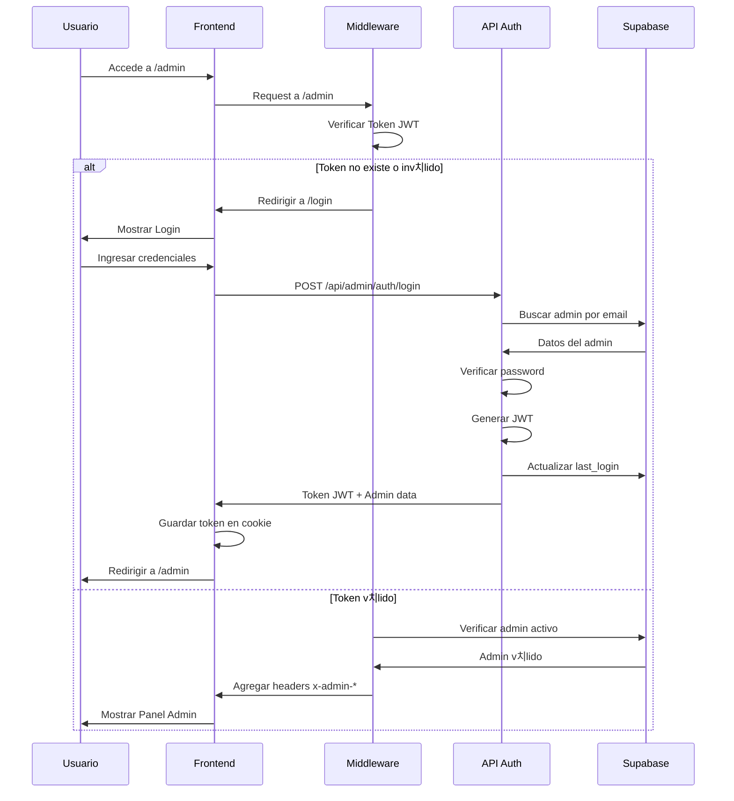
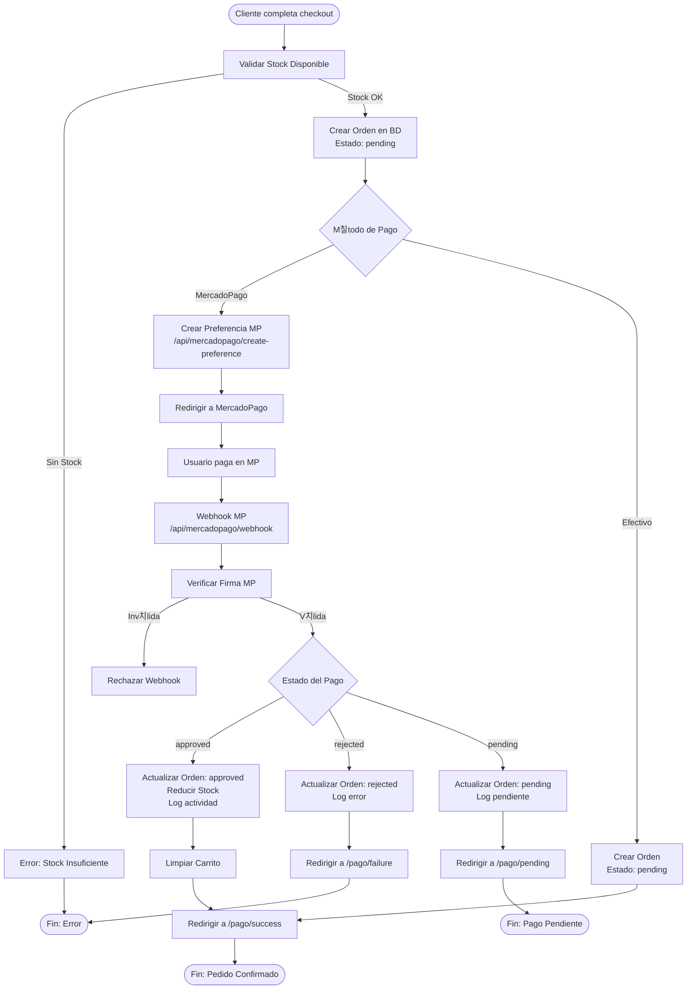
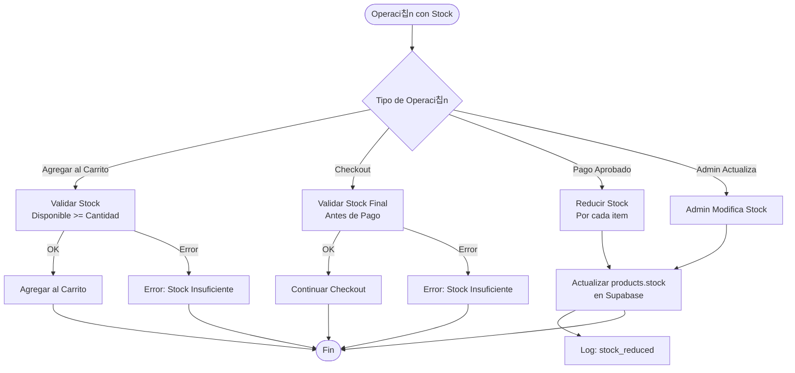

# 📊 Diagrama de Flujo del Sistema - ViveroWeb

## 🎯 Diagrama Completo del Sistema

Este documento contiene el diagrama de flujo principal del sistema ViveroWeb, representando todos los flujos de usuario y procesos técnicos.

---

## 📐 Diagrama Principal (Mermaid)

```mermaid
flowchart TB
    Start([Usuario accede al sistema]) --> TipoUsuario{Tipo de Usuario}
    
    %% FLUJO CLIENTE INVITADO
    TipoUsuario -->|Invitado| ClienteInicio[Página Principal /]
    ClienteInicio --> Navegacion[Navegar Catálogo]
    Navegacion --> Buscar{Buscar/Filtrar?}
    Buscar -->|Sí| BuscarProductos[Buscar Productos]
    BuscarProductos --> VerProducto[Ver Detalle Producto]
    Buscar -->|No| VerProducto
    VerProducto --> AgregarCarrito{Agregar al Carrito?}
    AgregarCarrito -->|Sí| ValidarStock[Validar Stock Disponible]
    ValidarStock -->|Stock OK| GuardarCarrito[Guardar en localStorage]
    ValidarStock -->|Sin Stock| ErrorStock[Mostrar Error: Sin Stock]
    ErrorStock --> VerProducto
    AgregarCarrito -->|No| Navegacion
    GuardarCarrito --> IrCarrito{Ir al Carrito?}
    IrCarrito -->|Sí| PaginaCarrito[/carrito]
    IrCarrito -->|No| Navegacion
    
    PaginaCarrito --> RevisarCarrito[Revisar Items del Carrito]
    RevisarCarrito --> ModificarCarrito{Modificar Carrito?}
    ModificarCarrito -->|Cambiar Cantidad| ActualizarCantidad[Actualizar Cantidad]
    ModificarCarrito -->|Eliminar| EliminarItem[Eliminar Item]
    ModificarCarrito -->|Continuar| SeleccionarEnvio[Seleccionar Envío a Domicilio]
    ActualizarCantidad --> RevisarCarrito
    EliminarItem --> RevisarCarrito
    
    SeleccionarEnvio --> IrCheckout[Ir a Checkout]
    IrCheckout --> PaginaPago[/carrito/pago]
    PaginaPago --> FormularioCliente[Completar Formulario Cliente]
    FormularioCliente --> ValidarForm{Validar Información?}
    ValidarForm -->|Inválido| ErrorForm[Mostrar Errores]
    ErrorForm --> FormularioCliente
    ValidarForm -->|Válido| ValidarStockCheckout[Validar Stock Final]
    ValidarStockCheckout -->|Sin Stock| ErrorStockCheckout[Error: Stock Insuficiente]
    ErrorStockCheckout --> PaginaCarrito
    ValidarStockCheckout -->|Stock OK| SeleccionarPago[Seleccionar Método de Pago]
    
    SeleccionarPago --> TipoPago{Método de Pago}
    TipoPago -->|MercadoPago| CrearPreferencia[Crear Preferencia MP]
    TipoPago -->|Efectivo| CrearOrdenEfectivo[Crear Orden Pending]
    
    CrearPreferencia --> CrearOrdenMP[Crear Orden en BD estado: pending]
    CrearOrdenMP --> RedirigirMP[Redirigir a MercadoPago]
    RedirigirMP --> PagoMP[Usuario paga en MercadoPago]
    PagoMP --> WebhookMP[Webhook MP notifica resultado]
    
    WebhookMP --> ResultadoPago{Resultado Pago}
    ResultadoPago -->|Aprobado| ProcesarPagoExitoso[Procesar Pago Exitoso]
    ResultadoPago -->|Rechazado| ProcesarPagoRechazado[Procesar Pago Rechazado]
    ResultadoPago -->|Pendiente| ProcesarPagoPendiente[Procesar Pago Pendiente]
    
    ProcesarPagoExitoso --> ActualizarOrden[Actualizar Orden: approved]
    ActualizarOrden --> ReducirStock[Reducir Stock Productos]
    ReducirStock --> LimpiarCarrito[Limpiar Carrito]
    LimpiarCarrito --> PaginaSuccess[/pago/success]
    
    ProcesarPagoRechazado --> ActualizarOrdenRechazado[Actualizar Orden: rejected]
    ActualizarOrdenRechazado --> PaginaFailure[/pago/failure]
    
    ProcesarPagoPendiente --> ActualizarOrdenPendiente[Actualizar Orden: pending]
    ActualizarOrdenPendiente --> PaginaPending[/pago/pending]
    
    CrearOrdenEfectivo --> PaginaSuccess
    
    PaginaSuccess --> FinCliente([Fin: Pedido Confirmado])
    PaginaFailure --> FinCliente
    PaginaPending --> FinCliente
    
    %% FLUJO ADMINISTRADOR
    TipoUsuario -->|Administrador| AdminInicio[Acceder a /admin]
    AdminInicio --> MiddlewareAuth{쯊oken JWT válido?}
    MiddlewareAuth -->|No| RedirigirLogin[Redirigir a /login]
    MiddlewareAuth -->|Sí| PanelAdmin[Panel de Administración]
    
    RedirigirLogin --> LoginPage[Página de Login]
    LoginPage --> IngresarCredenciales[Ingresar Email y Password]
    IngresarCredenciales --> ValidarLogin[Validar en /api/admin/auth/login]
    ValidarLogin --> LoginValido{쮺redenciales válidas?}
    LoginValido -->|No| ErrorLogin[Mostrar Error]
    ErrorLogin --> LoginPage
    LoginValido -->|Sí| GenerarToken[Generar Token JWT]
    GenerarToken --> GuardarToken[Guardar Token en Cookie]
    GuardarToken --> ActualizarLastLogin[Actualizar last_login]
    ActualizarLastLogin --> LogActividad[Registrar en activity_logs]
    LogActividad --> PanelAdmin
    
    PanelAdmin --> MenuAdmin{쯈ué gestionar?}
    MenuAdmin -->|Productos| GestionProductos[Gestión de Productos]
    MenuAdmin -->|Pedidos| GestionPedidos[Gestión de Pedidos]
    MenuAdmin -->|Categorías| GestionCategorias[Gestión de Categorías]
    MenuAdmin -->|Ventas| HistorialVentas[Historial de Ventas]
    MenuAdmin -->|Logout| CerrarSesion[Cerrar Sesión]
    
    %% Gestión de Productos
    GestionProductos --> AccionProducto{Acción}
    AccionProducto -->|Crear| FormularioProducto[Formulario Nuevo Producto]
    AccionProducto -->|Editar| SeleccionarProducto[Seleccionar Producto]
    AccionProducto -->|Eliminar| ConfirmarEliminar[Confirmar Eliminación]
    AccionProducto -->|Importar| ImportarExcel[Subir Archivo Excel/CSV]
    
    FormularioProducto --> SubirImagenes[Subir Imágenes máx. 3]
    SubirImagenes --> ValidarImagenes{쯀mágenes válidas?}
    ValidarImagenes -->|No| ErrorImagenes[Error: Imágenes inválidas]
    ErrorImagenes --> SubirImagenes
    ValidarImagenes -->|Sí| GuardarProducto[Guardar en /api/products]
    GuardarProducto --> ActualizarBD[Actualizar BD: products]
    ActualizarBD --> LogCrearProducto[Log: product_created]
    LogCrearProducto --> GestionProductos
    
    SeleccionarProducto --> EditarProducto[Editar Información]
    EditarProducto --> GuardarCambios[Guardar Cambios]
    GuardarCambios --> ActualizarProducto[Actualizar en /api/products/[id]]
    ActualizarProducto --> LogEditarProducto[Log: product_updated]
    LogEditarProducto --> GestionProductos
    
    ConfirmarEliminar --> EliminarProducto[Eliminar en /api/products/[id]]
    EliminarProducto --> LogEliminarProducto[Log: product_deleted]
    LogEliminarProducto --> GestionProductos
    
    ImportarExcel --> ProcesarExcel[Procesar y Validar Datos]
    ProcesarExcel --> CrearProductosMasivo[Crear Productos Masivamente]
    CrearProductosMasivo --> LogImportar[Log: products_imported]
    LogImportar --> GestionProductos
    
    %% Gestión de Pedidos
    GestionPedidos --> ListaPedidos[Lista de Pedidos]
    ListaPedidos --> FiltrarPedidos{Filtrar por Estado?}
    FiltrarPedidos -->|Sí| AplicarFiltro[Aplicar Filtro]
    FiltrarPedidos -->|No| VerDetallePedido[Ver Detalle Pedido]
    AplicarFiltro --> VerDetallePedido
    
    VerDetallePedido --> AccionPedido{Acción sobre Pedido}
    AccionPedido -->|Completar| MarcarCompletado[Marcar como Completado]
    AccionPedido -->|Cancelar| CancelarPedido[Cancelar Pedido]
    AccionPedido -->|Actualizar| ActualizarEstado[Actualizar Estado]
    AccionPedido -->|Agregar Notas| AgregarNotas[Agregar Notas Internas]
    
    MarcarCompletado --> ActualizarPedido[Actualizar en /api/orders/[id]]
    CancelarPedido --> ActualizarPedido
    ActualizarEstado --> ActualizarPedido
    AgregarNotas --> ActualizarPedido
    
    ActualizarPedido --> LogPedido[Log: order_updated]
    LogPedido --> GestionPedidos
    
    %% Gestión de Categorías
    GestionCategorias --> AccionCategoria{Acción}
    AccionCategoria -->|Crear| CrearCategoria[Crear Categoría]
    AccionCategoria -->|Editar| EditarCategoria[Editar Categoría]
    AccionCategoria -->|Eliminar| EliminarCategoria[Eliminar Categoría]
    
    CrearCategoria --> GuardarCategoria[Guardar en /api/categories]
    EditarCategoria --> GuardarCategoria
    EliminarCategoria --> ValidarCategoria{쯊iene productos?}
    ValidarCategoria -->|Sí| ErrorCategoria[Error: No se puede eliminar]
    ValidarCategoria -->|No| GuardarCategoria
    GuardarCategoria --> GestionCategorias
    
    %% Historial de Ventas
    HistorialVentas --> FiltrarVentas[Filtrar por Fechas]
    FiltrarVentas --> VerReportes[Ver Reportes de Ventas]
    VerReportes --> ExportarDatos{쮼xportar?}
    ExportarDatos -->|Sí| Exportar[Exportar Datos]
    ExportarDatos -->|No| HistorialVentas
    Exportar --> HistorialVentas
    
    %% Logout
    CerrarSesion --> EliminarToken[Eliminar Token JWT]
    EliminarToken --> LogLogout[Log: admin_logout]
    LogLogout --> ClienteInicio
    
    %% Consulta de Pedidos (Invitado)
    FinCliente --> ConsultarPedido{쮺onsultar Pedido?}
    ConsultarPedido -->|Sí| ConsultaEmail[Consultar por Email]
    ConsultaEmail --> BuscarPedidoEmail[Buscar en /api/orders/guest/[email]]
    BuscarPedidoEmail --> MostrarPedidos[Mostrar Pedidos del Email]
    MostrarPedidos --> FinCliente
    ConsultarPedido -->|No| FinCliente
    
    %% Estilos
    classDef cliente fill:#4A90E2,stroke:#2E5C8A,stroke-width:2px,color:#fff
    classDef admin fill:#50C878,stroke:#2D8659,stroke-width:2px,color:#fff
    classDef pago fill:#FFD700,stroke:#B8860B,stroke-width:2px,color:#000
    classDef error fill:#FF6B6B,stroke:#C92A2A,stroke-width:2px,color:#fff
    classDef proceso fill:#E8E8E8,stroke:#666,stroke-width:2px,color:#000
    
    class ClienteInicio,Navegacion,BuscarProductos,VerProducto,AgregarCarrito,PaginaCarrito,RevisarCarrito,PaginaPago,FormularioCliente,ConsultaEmail cliente
    class AdminInicio,LoginPage,PanelAdmin,GestionProductos,GestionPedidos,GestionCategorias,HistorialVentas admin
    class CrearPreferencia,RedirigirMP,PagoMP,WebhookMP,ProcesarPagoExitoso pago
    class ErrorStock,ErrorForm,ErrorStockCheckout,ErrorLogin,ErrorImagenes,ErrorCategoria error
```

---

## 🔄 Diagrama Simplificado de Flujos Principales



---

## 🔐 Diagrama de Autenticación y Seguridad



---

## 💳 Diagrama de Proceso de Pago



---

## 📦 Diagrama de Gestión de Stock



---

## 📝 Notas del Diagrama

1. **Flujos Paralelos**: Los flujos de cliente y admin son independientes y pueden ejecutarse simultáneamente.

2. **Validaciones Múltiples**: El stock se valida en 3 puntos:
   - Al agregar al carrito
   - En el checkout
   - Antes de reducir stock en pago aprobado

3. **Webhook Asíncrono**: El webhook de MercadoPago se procesa de forma asíncrona, por lo que el usuario puede ser redirigido antes de que se complete el procesamiento.

4. **Middleware Global**: Todas las rutas `/admin/*` pasan por el middleware de autenticación antes de llegar al handler.

5. **Carrito Local**: El carrito se almacena en `localStorage` del navegador, no en el servidor, por lo que es específico de cada dispositivo/navegador.

---

**Versión**: 2.0.0  
**Última actualización**: 2025-01-27

