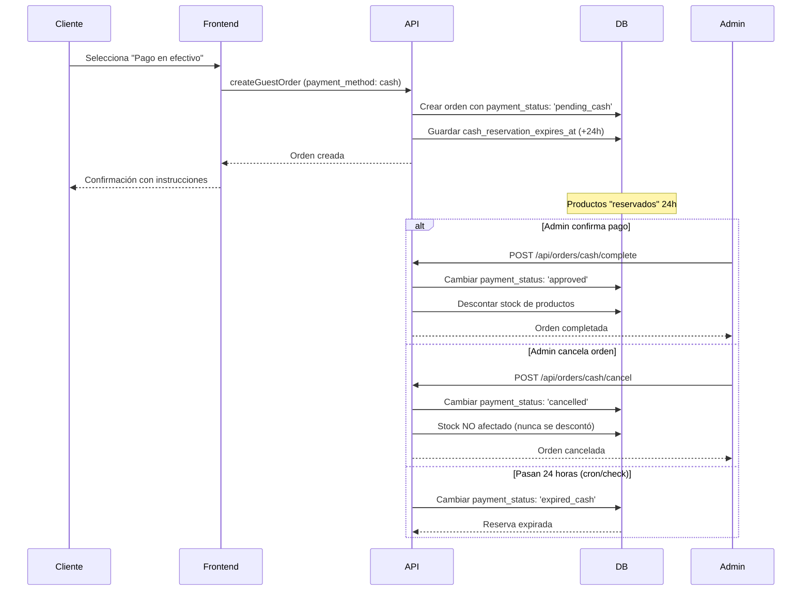

# Plan de Implementación: Funcionalidades de Pago

## Descripción General

Este documento describe los pasos necesarios para implementar dos nuevas funcionalidades en el sistema de checkout:

1. **Mostrar formulario de Dirección de Entrega condicionalmente**: Solo mostrar cuando "Envío a domicilio" esté marcado.
2. **Sistema de Pago en Efectivo con Reserva de Stock**: Implementar un flujo completo para pagos en efectivo con reserva de 24 horas, nuevo estado de orden, y restauración de stock al cancelar.

---

## Funcionalidad 1: Formulario de Dirección Condicional

### Descripción
El formulario de "Dirección de Entrega" en `/carrito/pago` solo debe mostrarse cuando la casilla de "Envío a domicilio" esté marcada.

### Archivo a Modificar

#### [MODIFY] [page.tsx](file:///d:/Users/Santiago/Desktop/ViveroWeb%20Yayo/app-vivero-web/app/carrito/pago/page.tsx)

#### Cambios Requeridos

El estado `envioDomicilio` ya existe (línea 31). Solo hay que envolver el bloque de "Dirección de Entrega" (líneas 277-366) con una condición:

```diff
-              {/* Dirección de entrega */}
-              <div className="bg-white rounded-xl shadow-lg p-6">
+              {/* Dirección de entrega - Solo mostrar si envioDomicilio está activo */}
+              {envioDomicilio && (
+                <div className="bg-white rounded-xl shadow-lg p-6">
                   <h2 className="text-2xl font-bold text-green-800 mb-6 flex items-center">
                     <MapPin className="h-6 w-6 mr-2" />
                     Dirección de Entrega
                   </h2>
                   {/* ... resto del formulario de dirección ... */}
                 </div>
+              )}
```

> [!NOTE]
> Este cambio es simple y no afecta la lógica existente. El estado `envioDomicilio` ya se guarda en `localStorage` correctamente.

---

## Funcionalidad 2: Sistema de Pago en Efectivo con Reserva de Stock

### Descripción
Cuando un cliente elige "Pago en efectivo", los productos deben reservarse por un máximo de 24 horas. El admin puede:
- Marcar la orden como "Completada" → Se descuenta el stock
- Cancelar la orden → Se restaura el stock reservado

### Archivos a Modificar

#### [MODIFY] [order.ts](file:///d:/Users/Santiago/Desktop/ViveroWeb%20Yayo/app-vivero-web/src/types/order.ts)

**Agregar nuevo PaymentStatus para pago en efectivo pendiente:**

```typescript
export type PaymentStatus =
  | 'pending'           // Pago pendiente (MercadoPago)
  | 'pending_cash'      // NUEVO: Pago en efectivo pendiente (reserva 24h)
  | 'approved'          // Pago aprobado
  | 'rejected'          // Pago rechazado
  | 'cancelled'         // Pago cancelado
  | 'expired_cash'      // NUEVO: Pago en efectivo expirado (pasaron 24h)
  | 'in_process'
  | 'authorized'
  | 'refunded'
```

**Agregar campo para tracking de reserva:**

```typescript
// En interface Order, agregar:
cash_reservation_expires_at?: string  // Fecha/hora de expiración de reserva
```

---

#### [MODIFY] [orderStatus.ts](file:///d:/Users/Santiago/Desktop/ViveroWeb%20Yayo/app-vivero-web/src/lib/orderStatus.ts)

**Actualizar tipos y mapeos para incluir estados de efectivo:**

```typescript
// Agregar a PaymentStatus
export type PaymentStatus = 
  | 'pending'
  | 'pending_cash'    // NUEVO
  | 'approved'
  | 'rejected'
  | 'cancelled'
  | 'expired_cash'    // NUEVO
  | 'in_process'
  | 'authorized'
  | 'refunded';

// Agregar nuevo UiState
export type UiState = 
  | 'Completado'
  | 'Envío pendiente'
  | 'Listo para retirar'
  | 'Pendiente'
  | 'Pendiente Efectivo'  // NUEVO
  | 'Rechazado'
  | 'Cancelado'
  | 'Expirado';           // NUEVO

// Actualizar función toUiState()
if (paymentStatus === 'pending_cash') {
  return 'Pendiente Efectivo';
}
if (paymentStatus === 'expired_cash') {
  return 'Expirado';
}

// Agregar colores para nuevos estados
case 'Pendiente Efectivo':
  return 'bg-amber-500 text-black font-bold border-amber-600';
case 'Expirado':
  return 'bg-gray-600 text-white font-bold border-gray-700';
```

---

#### [MODIFY] [orderService.ts](file:///d:/Users/Santiago/Desktop/ViveroWeb%20Yayo/app-vivero-web/src/services/orderService.ts)

**Agregar nuevos métodos:**

```typescript
/**
 * Reservar stock para pago en efectivo (no descuenta, solo marca)
 * Los productos se reservan por 24 horas
 */
async reserveStockForCashPayment(orderId: string, items: Array<{product_id: string, quantity: number}>): Promise<boolean>

/**
 * Marcar orden de efectivo como completada y descontar stock
 * Solo para órdenes con payment_status = 'pending_cash'
 */
async completeCashOrder(orderId: string): Promise<Order>

/**
 * Cancelar orden de efectivo y restaurar stock reservado
 * Solo para órdenes con payment_status = 'pending_cash'
 */
async cancelCashOrder(orderId: string, reason?: string): Promise<Order>

/**
 * Restaurar stock de productos de una orden
 */
async restoreStock(items: Array<{product_id: string, quantity: number}>): Promise<boolean>

/**
 * Verificar y expirar órdenes de efectivo pasadas las 24 horas
 * Llamar periódicamente (cron job o al cargar admin)
 */
async checkAndExpireCashOrders(): Promise<number>
```

---

#### [MODIFY] [productService.ts](file:///d:/Users/Santiago/Desktop/ViveroWeb%20Yayo/app-vivero-web/src/services/productService.ts)

**Agregar método para restaurar stock:**

```typescript
/**
 * Restaurar stock de un producto (para cancelaciones)
 */
async restoreStock(id: string, quantity: number): Promise<boolean> {
  const { data } = await supabase
    .from('products')
    .select('stock')
    .eq('id', id)
    .single()
  
  if (!data) return false
  
  const newStock = data.stock + quantity
  
  const { error } = await supabase
    .from('products')
    .update({ stock: newStock, updated_at: new Date().toISOString() })
    .eq('id', id)
  
  return !error
}
```

---

#### [MODIFY] Panel de Administración

Ubicación: Buscar archivo de admin que maneja órdenes (probablemente `app/admin/page.tsx`).

**Agregar botones condicionales para órdenes de efectivo:**

```tsx
{order.payment_status === 'pending_cash' && (
  <div className="flex gap-2">
    <button 
      onClick={() => handleCompleteCashOrder(order.id)}
      className="bg-green-600 hover:bg-green-700 text-white px-4 py-2 rounded"
    >
      Confirmar Pago
    </button>
    <button 
      onClick={() => handleCancelCashOrder(order.id)}
      className="bg-red-600 hover:bg-red-700 text-white px-4 py-2 rounded"
    >
      Cancelar Orden
    </button>
  </div>
)}
```

---

#### [NEW] API Routes para acciones de efectivo

#### [NEW] [route.ts](file:///d:/Users/Santiago/Desktop/ViveroWeb%20Yayo/app-vivero-web/app/api/orders/cash/complete/route.ts)

```typescript
// POST /api/orders/cash/complete
// Body: { orderId: string }
// Marca orden como completada y descuenta stock
```

#### [NEW] [route.ts](file:///d:/Users/Santiago/Desktop/ViveroWeb%20Yayo/app-vivero-web/app/api/orders/cash/cancel/route.ts)

```typescript
// POST /api/orders/cash/cancel
// Body: { orderId: string, reason?: string }
// Cancela orden y restaura stock
```

---

## Base de Datos (Supabase)

> [!IMPORTANT]
> Se requiere agregar columna a la tabla `orders`:

```sql
ALTER TABLE orders 
ADD COLUMN cash_reservation_expires_at TIMESTAMP WITH TIME ZONE;

-- Índice para queries de expiración
CREATE INDEX idx_orders_cash_expiration ON orders(cash_reservation_expires_at) 
WHERE payment_status = 'pending_cash';
```

---

## Flujo de Pago en Efectivo



---

## Plan de Verificación

### Pruebas Manuales

1. **Verificar ocultamiento de dirección**:
   - Ir a `/carrito/pago` con productos en el carrito
   - Verificar que el formulario de "Dirección de Entrega" NO se muestra
   - Marcar "Envío a domicilio"
   - Verificar que el formulario SÍ se muestra
   - Desmarcar la casilla
   - Verificar que el formulario desaparece

2. **Verificar flujo de pago en efectivo**:
   - Crear orden con "Pago en efectivo"
   - Verificar que aparece en admin con estado "Pendiente Efectivo"
   - Verificar que aparecen botones "Confirmar Pago" y "Cancelar Orden"
   - Probar confirmar: verificar que stock se descuenta
   - Crear otra orden y cancelarla: verificar que stock no cambia

---

## Resumen de Archivos

| Archivo | Acción | Complejidad |
|---------|--------|-------------|
| `app/carrito/pago/page.tsx` | MODIFICAR | Baja |
| `src/types/order.ts` | MODIFICAR | Baja |
| `src/lib/orderStatus.ts` | MODIFICAR | Media |
| `src/services/orderService.ts` | MODIFICAR | Alta |
| `src/services/productService.ts` | MODIFICAR | Baja |
| `app/admin/page.tsx` | MODIFICAR | Media |
| `app/api/orders/cash/complete/route.ts` | CREAR | Media |
| `app/api/orders/cash/cancel/route.ts` | CREAR | Media |
| Base de datos (Supabase) | MIGRACIÓN | Baja |
